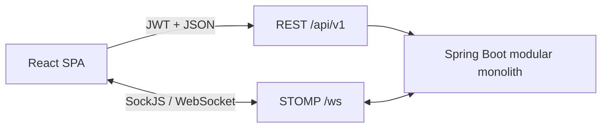

# Frontend architecture

## Scope

Luma Client is a static React + TypeScript SPA. It is not a Next.js application and it does not contain a second business backend. The Spring Boot application remains the single modular monolith; this repository is only its web client.

## Source boundaries

| Area | Responsibility |
| --- | --- |
| `features/auth` | Token lifecycle, session bootstrap, OTP and OAuth flows |
| `features/conversations` | Conversation list/detail, membership, invite, and join-request operations |
| `features/chat` | Cursor history, STOMP lifecycle, message cache, composer, and message actions |
| `features/profile` | Current-user search and profile operations |
| `components/ui` | Reusable accessible primitives without business logic |
| `lib` | API client, runtime configuration, errors, tokens, and query client |

## Session model

The backend returns access and refresh tokens in JSON. The access token is cached in module memory and mirrored to local storage so the SPA can restore a session after reload. The Axios interceptor performs a single-flight refresh on the first eligible `401`, rotates both tokens, retries the original request once, and emits a session-expired event if rotation fails.

STOMP CONNECT always reads the current access token. Reconnect therefore uses a rotated token instead of retaining a stale token from the first page load.

## Realtime and cache consistency

The active conversation subscribes to `/topic/conversations/{id}` and `/user/queue/errors`. Created, updated, and deleted events update the infinite-message cache. Conversation summaries are invalidated so the server remains authoritative for unread count and last-message metadata.

When the socket is temporarily unavailable, sending and read receipts fall back to REST. Cursor pagination uses `beforeSequence`, matching the monolith contract and avoiding offset drift while new messages arrive.

## Attachment boundary

The backend MVP accepts attachment URL metadata rather than binary uploads. The composer exposes that capability honestly as a public URL field. Direct object-storage upload with pre-signed URLs remains a future feature; the SPA does not pretend that local file upload already exists.

## Deployment

The production image builds static assets and serves them from Nginx. The same Nginx process provides SPA route fallback and proxies REST, OAuth, SockJS, and native WebSocket traffic to `BACKEND_HOST`. Static frontend delivery does not change the backend from a modular monolith into microservices.
